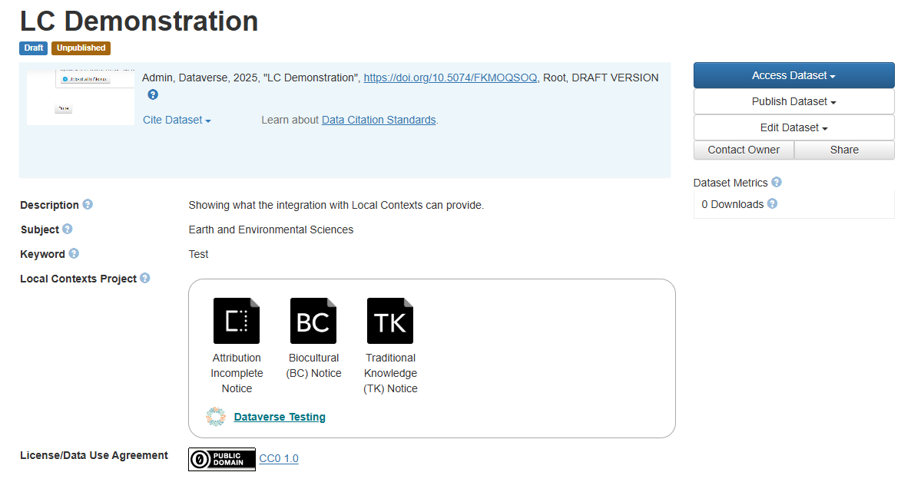

# LocalContexts Integration

## Overview

[Local Contexts](https://localcontexts.org/) is a global initiative that supports Indigenous communities in the management and sharing of their cultural heritage and data.
The [Local Contexts Hub](https://localcontextshub.org/) is a platform that enables the creation and application of Traditional Knowledge (TK) and Biocultural (BC) Labels and Notices. These labels and notices help to communicate the cultural context and appropriate use of Indigenous data and cultural heritage materials.

Dataverse supports integration with the Local Contexts Hub so that Labels and Notices associated with a dataset can be displayed on the dataset page:

## Configuration

There are several steps to Local Contexts integration:

1. Configure the `LOCALCONTEXTS_URL` and `LOCALCONTEXTS_API_KEY` as described in the [Local Contexts section of the Dataverse Installation Guide] https://guides.dataverse.org/en/latest/installation/localcontexts.html). API Keys are available to Local Contexts Integration Partners - see [https://localcontexts.org/hub-agreements/integration-partners/](https://localcontexts.org/hub-agreements/integration-partners/) for details.

2. Add the [Local Contexts metadatablock](./cvocLocalContexts.tsv) as described in the [Dataverse Guides](https://guides.dataverse.org/en/6.5/admin/metadatacustomization.html#loading-tsv-files-into-a-dataverse-installation). The metadatablock contains one field allowing Dataverse to store the URL of an associated Local Contexts Hub project.

3. Configure the associated external vocabulary script. The external vocabulary script interacts with the Local Contexts Hub (via the Dataverse server) to display the Labels and Notices associated with the project and provide a link to it. The script also supports adding/removing such a link from the dataset's metadata. Note that only a project that references the dataset in its `publication_doi` field can be linked to a dataset. See the instructions in the main [README.md](../../README.md) of this repository for details on this step. Use the [lc-cvoc-conf.json](./lc-cvoc-conf.json) file for production environments or [lc-sandbox-cvoc.json](./lc-sandbox-cvoc.json) for testing environments.

4. Finally, if you wish the Local Contexts information to be shown in the summary section of the dataset page, as shown in the image above, add `LCProjectUrl` to the list of custom summary fields via the [CustomDatasetSummaryFields](https://guides.dataverse.org/en/latest/installation/config.html#customdatasetsummaryfields) setting.
